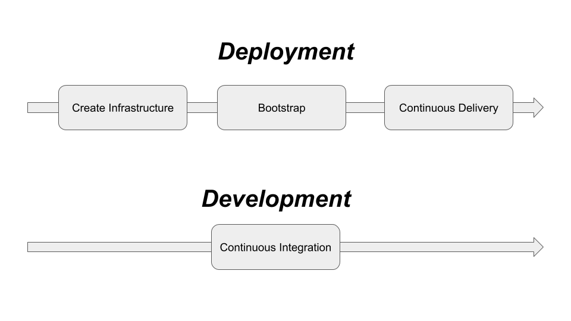

You deploy with `kubectl apply` from your laptop. It works. Then a colleague edits a deployment directly on the cluster to fix something urgent. Now what is running no longer matches what is in Git. That is drift, and it is silent — until something breaks in production and nobody can explain why the live state differs from the last known good config.

So you use ArgoCD. Git becomes the single source of truth. Every change flows through a pull request, gets reviewed, and syncs to the cluster automatically. If anyone touches a resource directly, ArgoCD detects the divergence and overrides it back. The cluster converges to Git, always.

This is GitOps: the deployment pipeline is driven by Git state, not by humans running commands.

## CI vs CD

A useful mental separation: CI and CD are different concerns and should be handled by different tools.



**CI** (Continuous Integration) is about code — build, test, produce an artifact (a container image). A pipeline in GitHub Actions, Tekton, or Jenkins owns this. It ends with an image pushed to a registry.

**CD** (Continuous Delivery) is about cluster state — take that artifact and make sure the right version is running in the right environment. ArgoCD owns this. It watches Git, not the CI pipeline.

Keeping them separate means your deployment logic is not buried inside a CI pipeline that developers need to understand and maintain. ArgoCD runs in the cluster and continuously reconciles state. It is always on.

## Applications

ArgoCD manages **Applications** — a CRD that maps a Git source to a cluster destination:

```yaml
apiVersion: argoproj.io/v1alpha1
kind: Application
metadata:
  name: my-app
  namespace: argocd
spec:
  project: default
  source:
    repoURL: https://github.com/myorg/my-app-config
    targetRevision: main
    path: manifests/
  destination:
    server: https://kubernetes.default.svc
    namespace: my-app
  syncPolicy:
    automated:
      prune: true
      selfHeal: true
```

`prune: true` — resources removed from Git are deleted from the cluster.
`selfHeal: true` — any manual change to the cluster is immediately reverted.

## App of Apps

Managing dozens of Applications individually gets unwieldy. The **App of Apps** pattern solves this: one root Application whose source is a directory of other Application manifests. ArgoCD applies the root, which creates all the child Applications, which in turn sync their own workloads. One repo, one sync, everything deployed.

## Sync strategies

| Strategy | Behaviour |
|---|---|
| Automated | ArgoCD syncs on every Git change automatically |
| Manual | Changes are detected and shown as OutOfSync — a human triggers the sync |

Automated sync with selfHeal is the purest GitOps posture. Manual sync is useful for production environments where you want a human approval step before changes roll out.

## Rollback

Because every state the cluster has ever been in corresponds to a Git commit, rollback is a `git revert` — or clicking "Sync to previous revision" in the ArgoCD UI. No special tooling, no runbooks, just Git history.

## Repo structure

A layout that works well in practice separates ArgoCD's own installation from the workloads it manages:

```
cluster/<cluster>/
  cfg/argo-cd/          # ArgoCD install only — CRDs and Helm values
  app-of-apps/          # Root Application, Projects, app definitions
  overlay/<app>/        # Per-cluster Kustomize patches, secret/config overrides

external/               # Reusable base manifests shared across clusters
internal/               # Internal app base manifests
```

The key separations:

- **ArgoCD install is isolated** in `cfg/argo-cd` to avoid recursive install loops and make upgrades predictable. ArgoCD is not managing its own installation yet at this point — that comes later.
- **App-of-Apps lives separately** from the install. Once ArgoCD is running, applying `app-of-apps/` bootstraps the entire cluster in one step.
- **Base vs overlay** — `external/` and `internal/` define *what an app is*. The cluster overlay defines *how it runs in this environment*. Cluster-specific concerns (resource limits, replica counts, secret refs) stay in the cluster directory and never bleed into the base.

## Bootstrapping a cluster

There is a chicken-and-egg problem: ArgoCD manages everything, but something has to install ArgoCD first. The two-step bootstrap solves it cleanly.

**Step 1 — Install ArgoCD manually (once):**

```bash
helm repo add argo https://argoproj.github.io/argo-helm
helm repo update
helm install argocd argo/argo-cd \
  -n argo-cd --create-namespace \
  -f cluster/staging/cfg/argo-cd/values.yaml
```

**Step 2 — Apply the App-of-Apps root:**

```bash
kubectl apply -k cluster/<cluster>/app-of-apps/
```

From this point ArgoCD reconciles the entire cluster. Every subsequent change goes through Git — you never run `helm install` or `kubectl apply` for workloads again.

## Self-management

The final step is making ArgoCD manage its own upgrades. Create an Application that points at `cluster/<cluster>/cfg/argo-cd`:

```yaml
apiVersion: argoproj.io/v1alpha1
kind: Application
metadata:
  name: argocd
  namespace: argocd
spec:
  project: default
  source:
    repoURL: https://github.com/myorg/cluster-config
    targetRevision: main
    path: cluster/staging/cfg/argo-cd
  destination:
    server: https://kubernetes.default.svc
    namespace: argocd
  syncPolicy:
    automated:
      prune: false   # be cautious pruning ArgoCD's own resources
      selfHeal: true
```

Now ArgoCD upgrades itself when you update the Helm values in Git. No more manual `helm upgrade` — the cluster is fully self-managing. Changes to ArgoCD config go through the same PR review process as everything else.

## Resources

- [ArgoCD documentation](https://argo-cd.readthedocs.io/)
- [GitOps principles](https://opengitops.dev/)
- [ArgoCD best practices](https://argo-cd.readthedocs.io/en/stable/user-guide/best_practices/)
