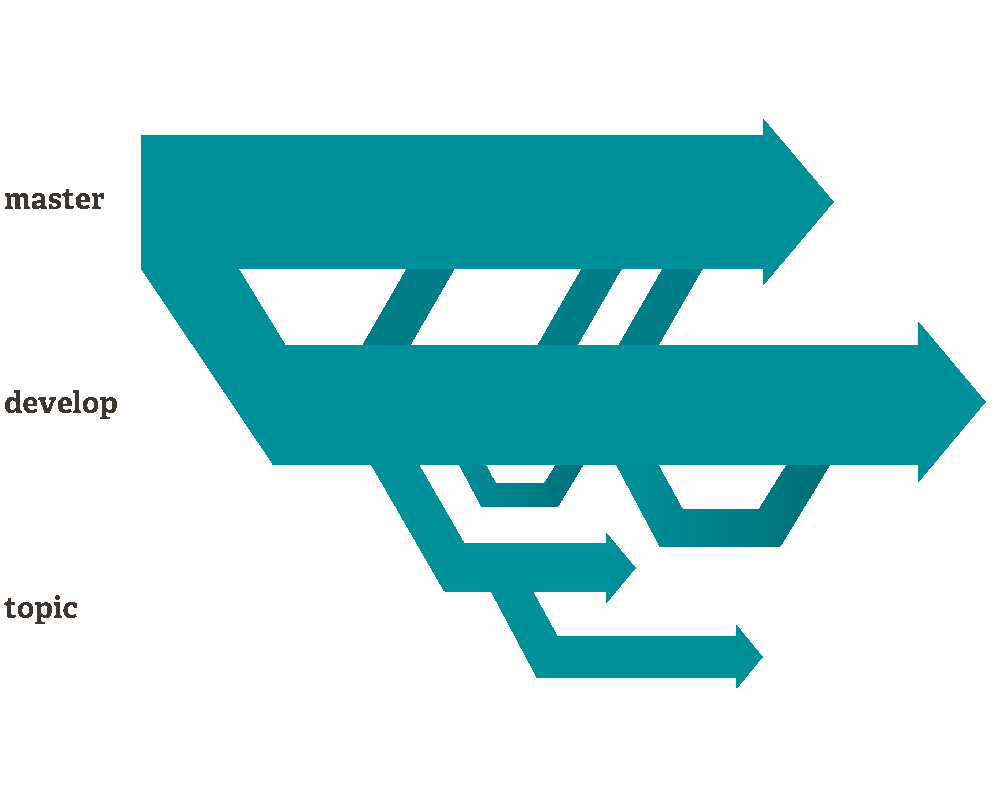
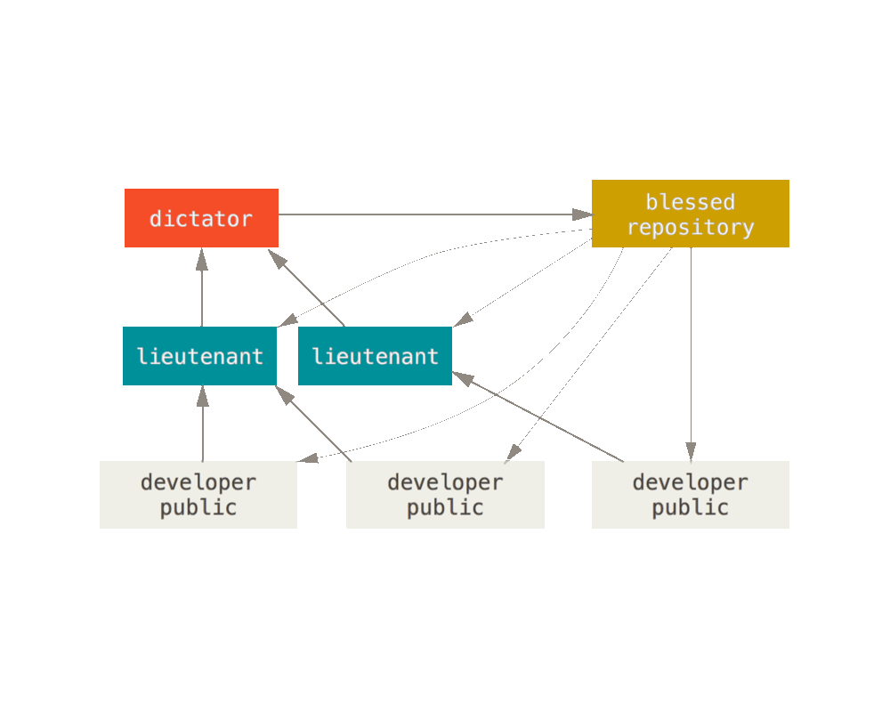
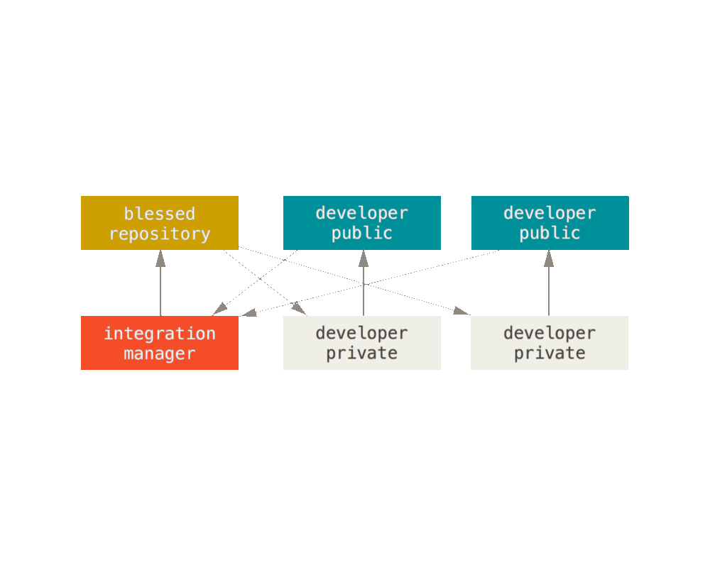
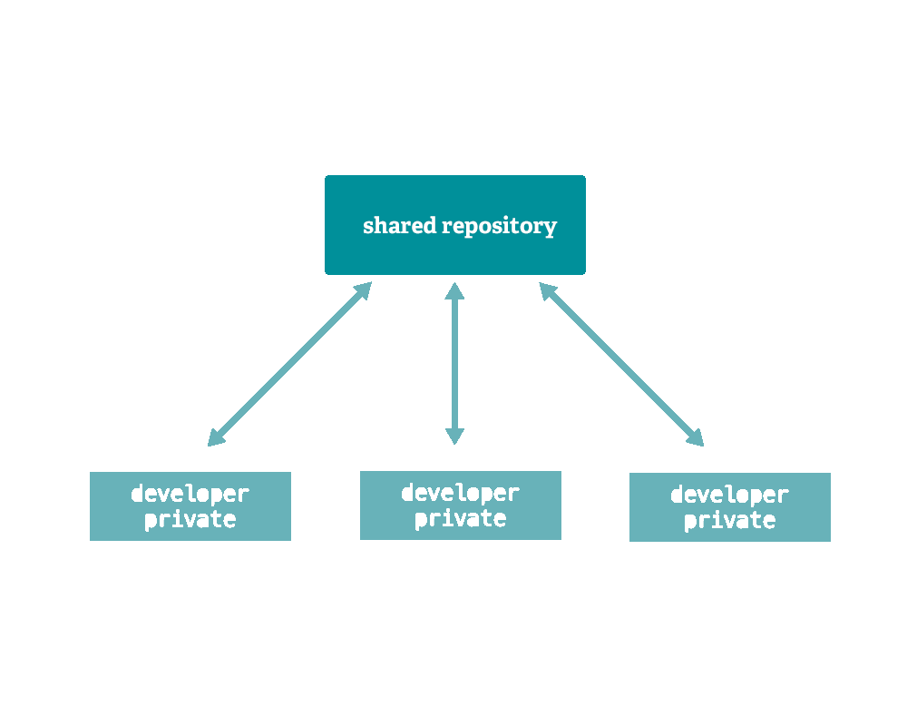
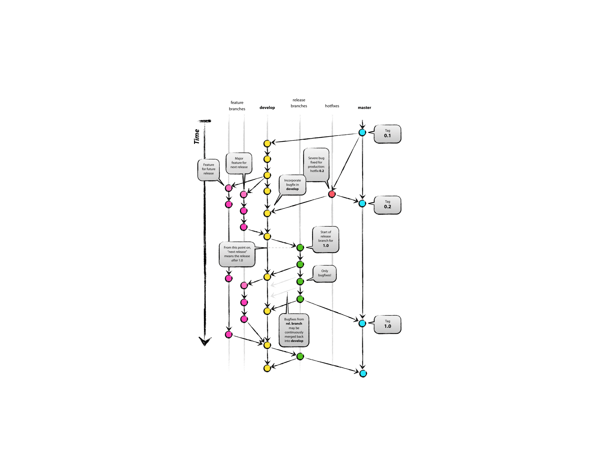

Git is the distributed version control system behind virtually all modern software development. Every clone is a full copy of the history — fast, local, and cryptographically integrity-checked.

## Branches

Branches in Git are cheap: creating, merging, and deleting them is fast because a branch is just a pointer to a commit, not a copy of the files.

By convention, one branch is singled out and called `main` (historically `master`).

## Workflows

How teams structure collaboration varies. Three common models:

**Benevolent dictator** — used by the Linux kernel. A hierarchy of trusted lieutenants, with one maintainer having final merge authority.

**Integration manager** — common in open source. Each contributor has their own public fork; a maintainer pulls from forks into a blessed repository.

**Shared repository** — the most common in companies. Everyone pushes to the same remote (`origin`). All instances are equal; `origin` is just a convention.

## Data integrity

Git's data model uses SHA-1 checksums for every file and commit. This means:
- Every object is verified on checkout
- History cannot be silently altered — changing any commit changes all IDs after it
- You can't push without first pulling (unless you force-push and overwrite)

## Merge vs rebase

Two ways to integrate branches:

**Merge** preserves history exactly as it happened — a merge commit ties the two branches together.

**Rebase** replays your commits on top of the target branch — produces a linear history but rewrites commit SHAs. Never rebase shared/public branches.

## Branch strategies

**Git Flow** — a structured model with `main`, `develop`, `feature/*`, `release/*`, and `hotfix/*` branches. Good for software with versioned releases.

[Git Flow original post](https://nvie.com/posts/a-successful-git-branching-model/)

**GitHub Flow / GitLab Flow** — simpler: branch from `main`, open a pull request, merge when reviewed. Works well for continuously deployed web apps.

[GitHub Flow](https://guides.github.com/introduction/flow/) · [GitLab Flow](https://docs.gitlab.com/ee/topics/gitlab_flow.html)

## Which strategy fits

| Project type | Recommendation |
|---|---|
| Library / SDK | Git Flow — versioned releases, may need to support multiple versions simultaneously |
| Web application | GitHub Flow — continuously delivered, no need for release branches |
| Client / installable app | Git Flow — users run specific versions you need to patch and maintain |

## Resources

- [git-scm.com](https://git-scm.com/docs)
- [GitHub Git cheat sheet](https://training.github.com/downloads/github-git-cheat-sheet/)
- [Interactive Git cheatsheet](https://ndpsoftware.com/git-cheatsheet.html)
