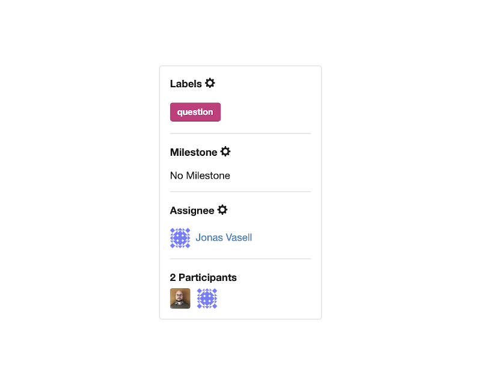
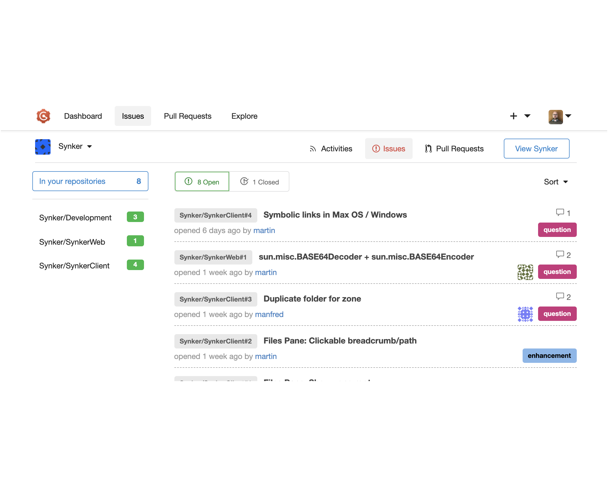

**[Gogs](https://gogs.io/)** came first — a self-hosted Git service, lightweight, single binary, runs anywhere. Think GitHub but on your own infrastructure. Simple to deploy, easy to understand, and that was the point.

Gitea forked from Gogs in 2016 and has moved considerably faster since — more features, more active development, more community. For any new self-hosted Git deployment, Gitea became the natural choice over Gogs. Unless you look at where Gitea itself is heading.

## Forgejo

Gitea has been drifting toward the enterprise and commercial end. The governance has shifted, cloud services have been prioritised, and the community-first ethos that made it attractive has weakened.

**[Forgejo](https://forgejo.org/)** is the community response — a fork of Gitea maintained by the Codeberg team, focused on staying open, community-governed, and free. It is a drop-in replacement: same API, same data format, same deployment model. Migrating from Gitea to Forgejo is straightforward.

For new deployments today, Forgejo is the better choice. Gitea is still solid and maintained, but the trajectory matters.

[Codeberg](https://codeberg.org/) — the public hosting platform run by the Forgejo maintainers — is worth knowing about as a GitHub alternative for open source projects.

## Features

- SSH and HTTPS repository access
- Issues, pull requests, code review, wiki, protected branches
- Webhooks and Git hooks
- Deploy keys and fine-grained access tokens
- LDAP, SMTP, OAuth, OIDC authentication
- PostgreSQL, MySQL, SQLite support
- Built-in container registry
- Gitea Actions / Forgejo Actions — GitHub Actions-compatible CI

## Issues

The issue tracker covers the basics well:

- Numeric ID, description, comment thread
- Assignable to users, file attachments, labels, milestones
- Open/closed state per repository

Default labels — fully customizable:

Organisation-wide issue overview:

## Resources

- [Forgejo](https://forgejo.org/) — community fork, recommended for new deployments
- [Gitea](https://gitea.io/)
- [Gogs](https://gogs.io/) — where it all started
- [Codeberg](https://codeberg.org/) — public Forgejo hosting
