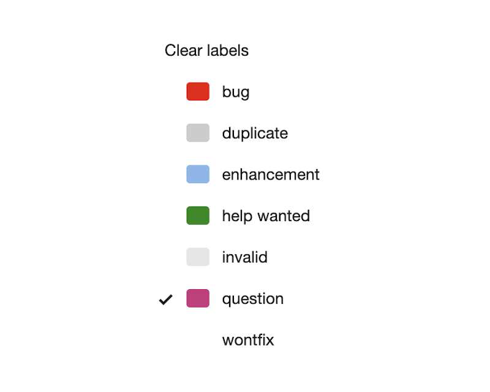

Gogs is a self-hosted Git service — lightweight, single binary, runs anywhere. Think GitHub but on your own infrastructure.

Worth noting: Gogs was forked into [Gitea](https://gitea.io/) in 2016, which has seen more active development since. For new deployments Gitea is the better choice; Gogs is still maintained but moves slowly.

## Features

- SSH and HTTPS access to repositories
- Issues, pull requests, wiki, protected branches
- Webhooks (Slack, Discord, Dingtalk) and Git hooks
- Deploy keys
- LDAP, SMTP, OAuth authentication
- PostgreSQL, MySQL, SQLite3 support
- 30+ UI languages

## Issues

The issue tracker covers the basics well:

- Numeric ID, text description, comment thread
- Assignable to a user, attach files, add labels, group into milestones
- Open/closed state per repository

Default labels — fully customizable:

Organisation-wide issue overview:

## Resources

- [gogs.io](https://gogs.io/)
- [Gitea](https://gitea.io/) — the more active fork, recommended for new deployments
