Kubernetes (K8s) is the de facto standard for container orchestration and the second largest open source project after the Linux kernel. It has well and truly reached the plateau of productivity — the ecosystem is mature and it genuinely delivers.

That said, the honest take: **K8s is ridiculously hard to deploy and manage** (day 2 operations especially). Docker Swarm is equally ridiculously easy to get started with. For raw scale, Mesos/DC/OS wins — clusters of 80k+ nodes have been documented in the wild, versus K8s master's practical ceiling of around 5k nodes.

So the real question is whether the ecosystem justifies the complexity for your situation. For most teams doing cloud-native work, it does.

## Core concepts

The main building blocks:

**Pods** — smallest deployable unit, wrapping one or more containers that share network and storage.

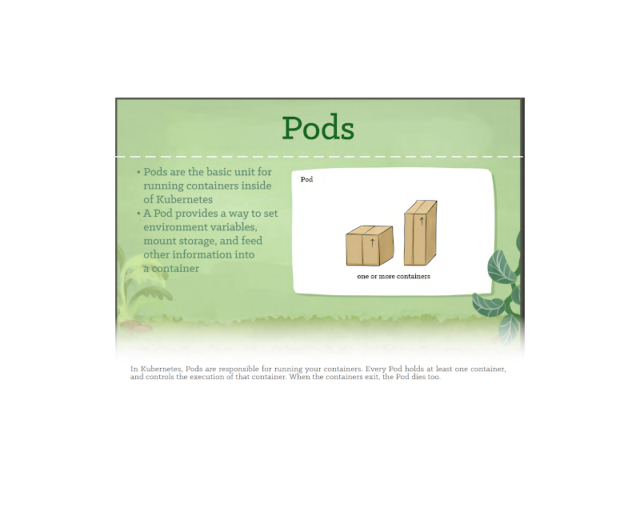

**Deployments** — declare desired state; K8s handles rolling updates and self-healing.

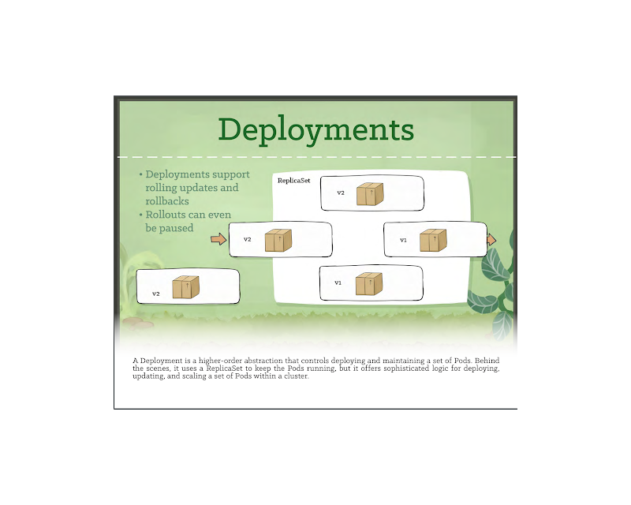

**Secrets** — store sensitive data (passwords, tokens, keys) separately from application config.

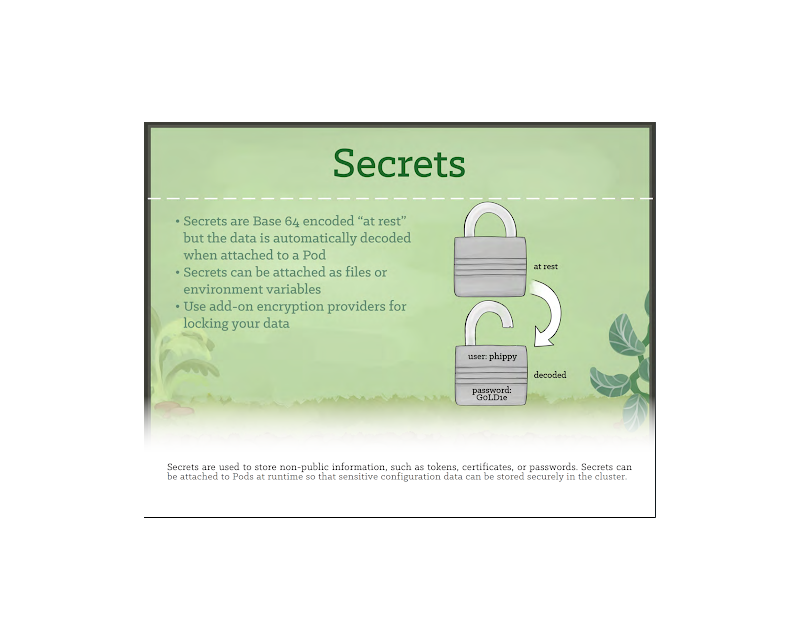

**DaemonSets** — run a pod on every node. Typical use: log collectors, monitoring agents.

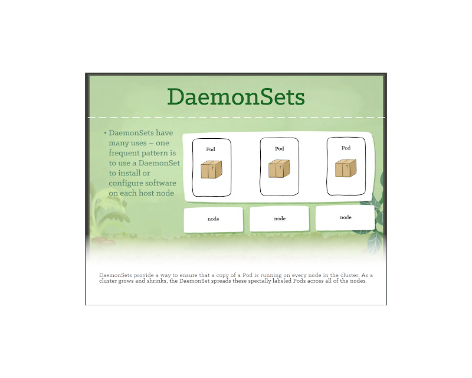

**ReplicaSets** — ensure N copies of a pod are running at any given time.

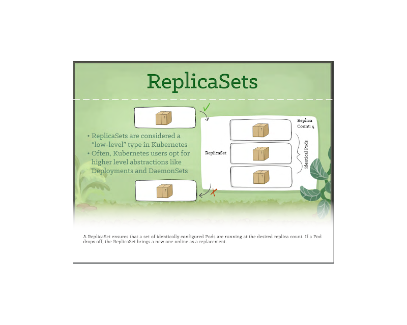

**Ingress** — HTTP/S routing rules at layer 7. Your load balancer config, declarative.

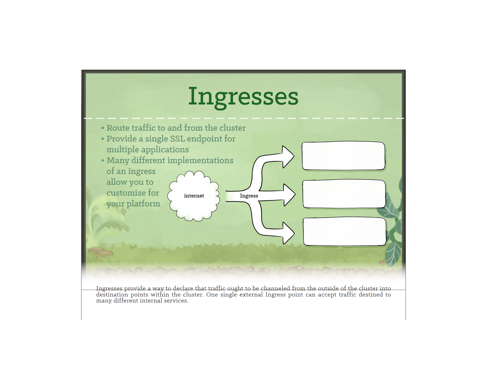

**CronJobs** — scheduled jobs, K8s-native.

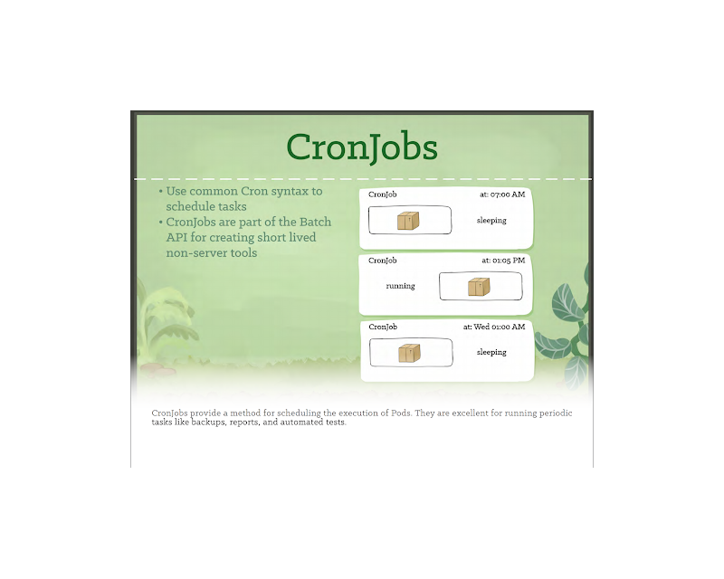

**Custom Resource Definitions (CRDs)** — extend the K8s API with your own resource types. The foundation of most K8s operators.

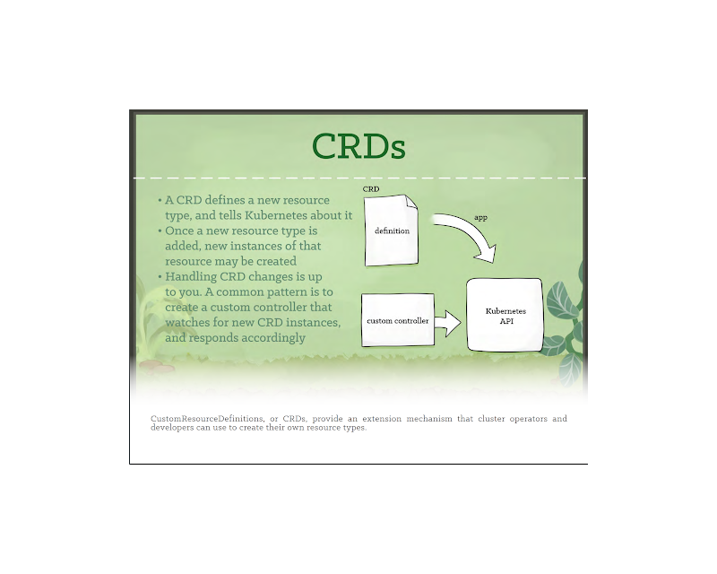

## Architecture

How the pieces fit together internally:

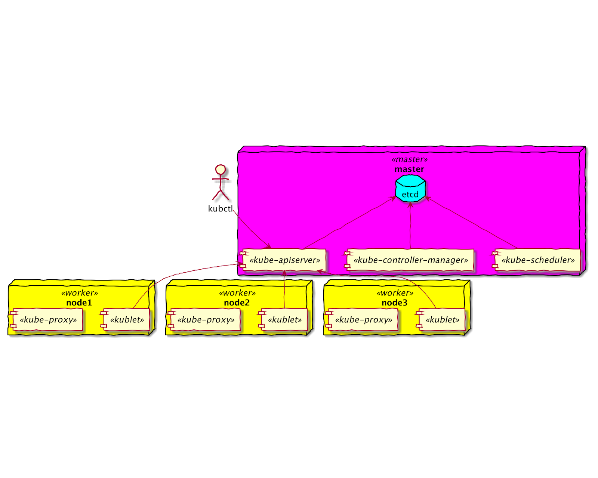

## Containers vs virtual machines

Not an either/or — they solve different problems and are frequently combined.

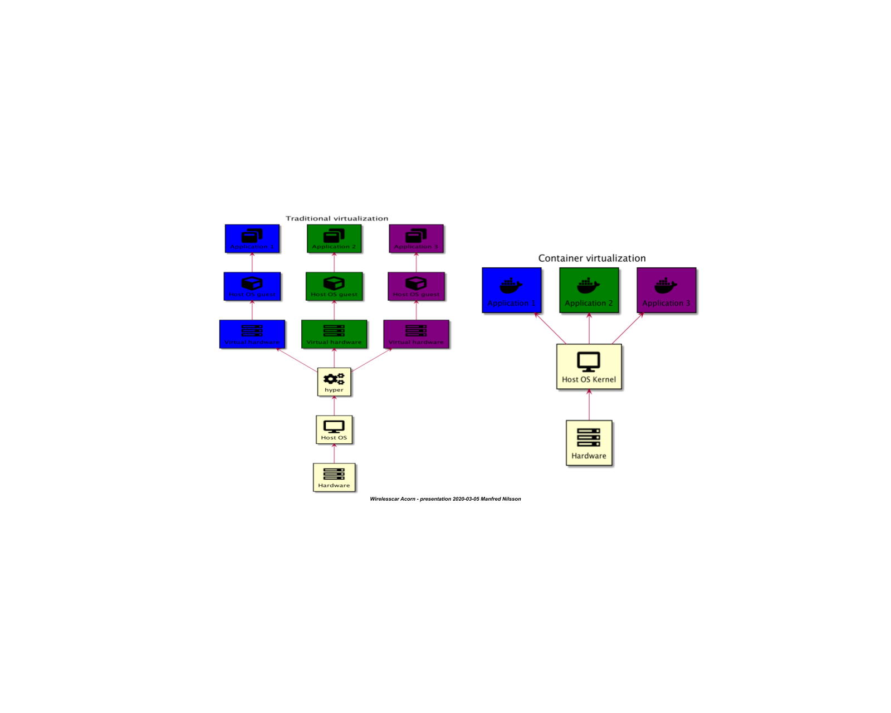

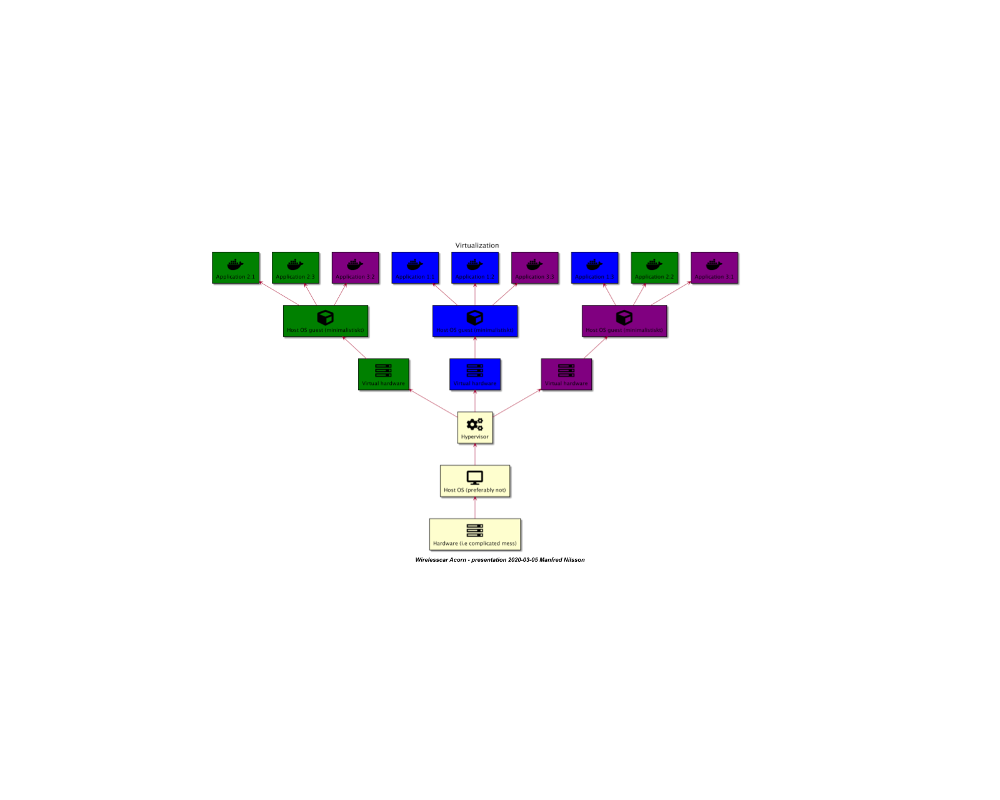

## Local clusters for development

When you need K8s without a full cluster:

| Tool | Best for |
|------|----------|
| [MicroK8s](https://microk8s.io/) | Ubuntu, snap-based, batteries included |
| [Minikube](https://minikube.sigs.k8s.io/) | The classic, broad driver support |
| [Kind](https://kind.sigs.k8s.io/) | K8s in Docker, great for CI pipelines |
| [K3D](https://k3d.io/) | K3s in Docker, fast startup |
| [K3S](https://k3s.io/) | Lightweight K8s, edge and IoT use cases |

## Resources

- [kubernetes.io](https://kubernetes.io/)
- [CNCF Landscape](https://landscape.cncf.io/) — map of the cloud-native ecosystem
- [TGI Kubernetes intro (YouTube)](https://www.youtube.com/watch?v=PH-2FfFD2PU)
- [Setting up MicroK8s with RBAC and Storage](https://igy.cx/posts/setup-microk8s-rbac-storage/)
