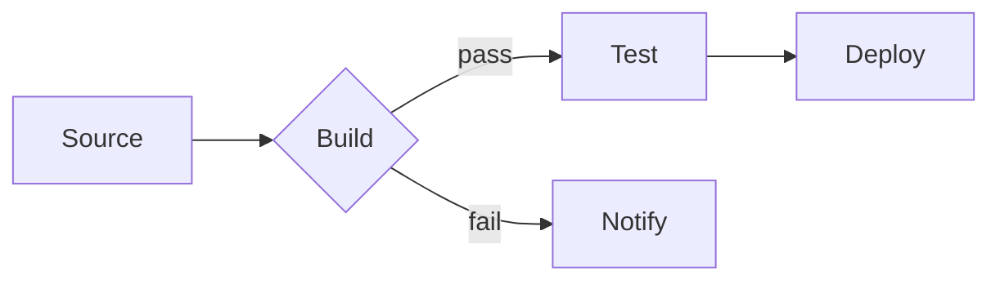
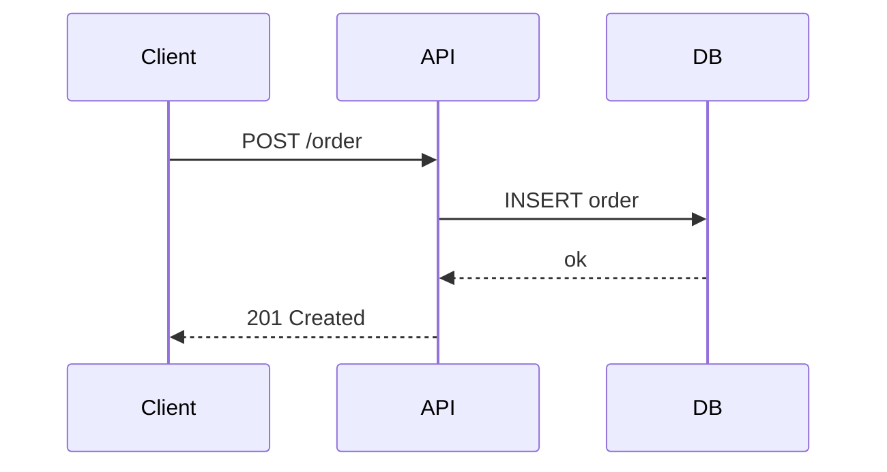
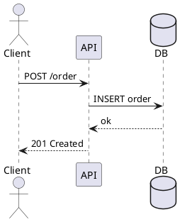
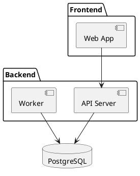

Diagrams as code: describe a diagram in text, render it as an image. No drag-and-drop, no binary file that diffs as noise, no diagram that goes stale because it's a PNG nobody updates. The source lives in Git alongside the code it describes.

## Mermaid

Mermaid is a JavaScript-based diagramming tool with a simple, readable syntax. It renders natively in GitHub Markdown, GitLab, and many documentation tools — paste a fenced code block with `mermaid` as the language and the diagram appears inline. No server needed for basic use.

Flowchart:

````markdown

````

Sequence diagram:

````markdown

````

Other supported types: class diagrams, entity-relationship, state machines, Gantt charts, Git graphs.

The [Mermaid live editor](https://mermaid.live) is the fastest way to iterate on a diagram.

## PlantUML

PlantUML predates Mermaid and has a wider set of diagram types — UML sequence, class, component, deployment, activity, state, and non-UML types like C4 (architecture), BPMN, and Gantt. The syntax is more verbose than Mermaid but more expressive for complex diagrams.

PlantUML requires a rendering server (Java-based, self-hostable) or the hosted server at `plantuml.com`. Most IDE plugins (IntelliJ, VS Code) bundle a renderer.

Sequence diagram:



Component diagram:



## Which to use

| | Mermaid | PlantUML |
|---|---|---|
| Renders in GitHub/GitLab | Yes, natively | No, requires plugin or pre-rendering |
| Setup | Zero | Rendering server or plugin |
| Syntax | Simple, readable | More verbose, more powerful |
| Diagram types | Core UML + Git/Gantt | Full UML + C4 + more |
| Best for | Quick diagrams in docs and READMEs | Complex architecture and UML diagrams |

## Resources

- [Mermaid documentation](https://mermaid.js.org/)
- [Mermaid live editor](https://mermaid.live)
- [PlantUML documentation](https://plantuml.com/)
- [PlantUML online server](https://www.plantuml.com/plantuml/uml/)
