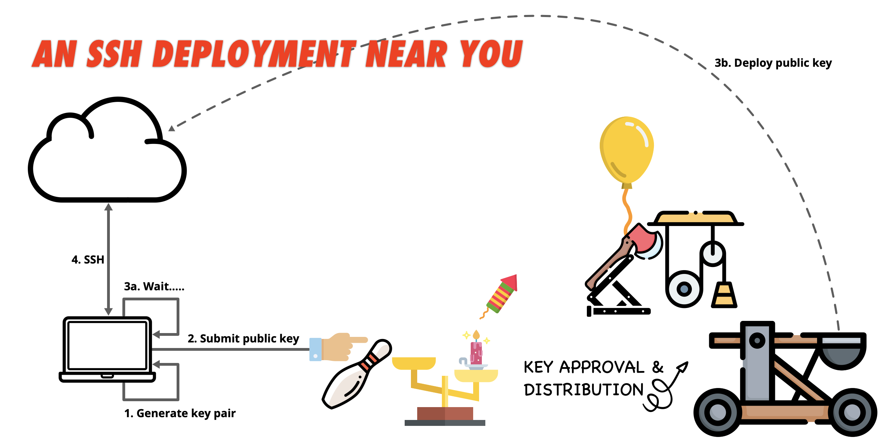
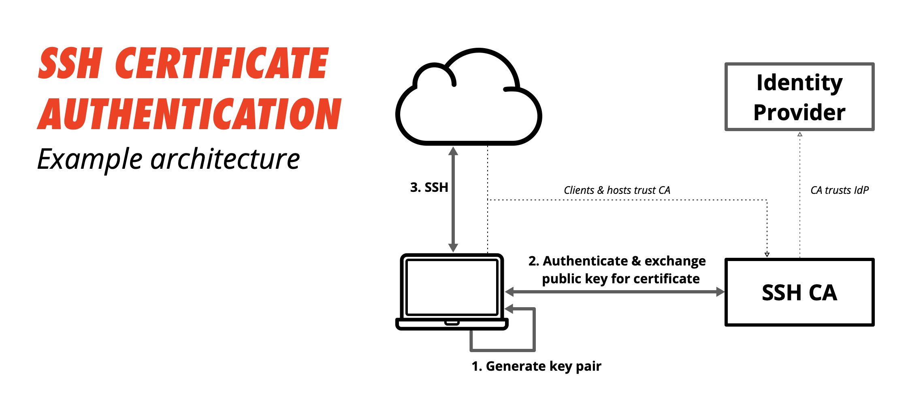

SSH (Secure Shell) is the standard protocol for encrypted remote access to Linux and Unix systems. It replaced telnet and rsh by wrapping the session in a cryptographic tunnel — authentication, commands, and data transfer all protected against interception and tampering.

## Public key authentication

The default auth mechanism for any serious setup. You generate a key pair: a private key that never leaves your machine, and a public key that goes on the remote host.

```bash
ssh-keygen -t ed25519 -C "your@email.com"
ssh-copy-id user@host          # appends public key to ~/.ssh/authorized_keys on remote
```

Prefer `ed25519` over the older `rsa` — smaller keys, faster, stronger. Keep your private key protected with a passphrase; use `ssh-agent` to avoid typing it repeatedly.

## Key deployment at scale

When you have many hosts, distributing public keys manually doesn't scale. A typical pattern: submit your public key to a central approval system, which then deploys it to the relevant hosts via automation (Ansible, Puppet, etc.).



This keeps a clear audit trail — keys are approved, recorded, and can be revoked centrally without touching individual `authorized_keys` files.

## Certificate authentication

At larger scale, even centralised key distribution gets unwieldy. SSH certificates solve this properly: instead of deploying individual public keys, you run an SSH Certificate Authority (CA). Hosts and users trust the CA, not each other's individual keys.



1. Generate a key pair locally
2. Submit the public key to the SSH CA (backed by your identity provider — FreeIPA, Vault, etc.)
3. The CA issues a signed certificate with a short TTL
4. SSH to any host — the host trusts the CA, so the certificate is accepted without any pre-deployed keys

Short-lived certificates (hours, not days) dramatically reduce the blast radius of a compromised credential. No revocation lists to maintain.

## SSH config

`~/.ssh/config` avoids repetitive flags on every connection:

```
Host bastion
    HostName bastion.example.com
    User deploy
    IdentityFile ~/.ssh/id_ed25519
    ForwardAgent yes

Host internal-*
    ProxyJump bastion
    User deploy
```

`ProxyJump` (formerly `-J`) lets you reach hosts that aren't directly accessible — you SSH through the bastion transparently.

## Port forwarding

SSH can tunnel TCP traffic, useful for reaching services on private networks:

```bash
# Local forward: reach remote Postgres via localhost:5432
ssh -L 5432:db.internal:5432 bastion

# Dynamic forward: SOCKS proxy through the bastion
ssh -D 1080 bastion
```

## Hardening basics

Key settings in `/etc/ssh/sshd_config`:

```
PermitRootLogin no
PasswordAuthentication no
PubkeyAuthentication yes
AllowUsers deploy ansible
```

Disable password auth entirely once keys are in place. Restrict which users can log in. Run `sshd -t` to validate config before reloading.

## Resources

- [OpenSSH manual](https://www.openssh.com/manual.html)
- [SSH certificate authentication (HashiCorp Vault)](https://developer.hashicorp.com/vault/docs/secrets/ssh/signed-ssh-certificates)
- [Mozilla SSH Guidelines](https://infosec.mozilla.org/guidelines/openssh)
